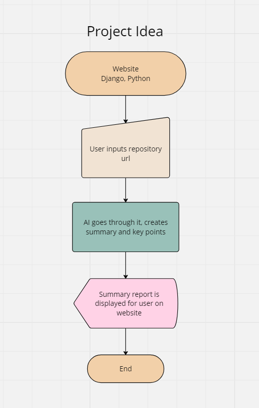

# CodeScope 🔎

**The Idea:** 

This is **the** tool for getting a quick idea and summarization of any repository online. Useful for both new and experienced developers, as well as non-developers to get familiar with a repository and its codebase.

